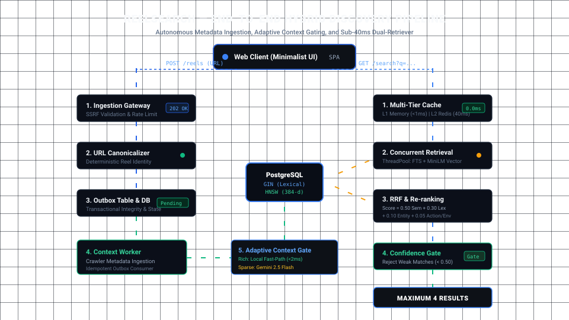

# ReelSearch — Instagram Reel Discovery & Semantic Indexing Platform

> A self-hostable, production-ready semantic index and discovery engine for public Instagram Reels.

Given an Instagram Reel URL, the platform generates a rich, machine-created structured representation of the Reel and makes it deeply searchable. Given a natural-language search query, it retrieves the most relevant Reels through hybrid search (PostgreSQL full-text + vector embeddings) and displays **at most four high-confidence results**.

---

## 1. Key Principles & Architecture

1. **Reel Identity is Deterministic**: Determined exclusively by canonical URL (`https://www.instagram.com/reel/{SHORTCODE}/`). Query params, tracking tokens, and trailing fragments are stripped. Identical URLs map to the same Reel.
2. **Zero User-Written Descriptions**: Users supply only the Reel URL. The machine generates the structured context (summary, objects, actions, entities, topics, environments, visual style, keywords).
3. **Adaptive Context Gating**: Rich captions (recipes, car specs) are processed through a zero-cost local NLP extractor (< 2ms). Sparse or conversational hooks automatically escalate to a structured generative model (Gemini 2.5 Flash).
4. **Hybrid Dual-Retriever**: PostgreSQL Full-Text Search (GIN `to_tsvector`) handles exact lexical keywords; dense embeddings (SentenceTransformers `all-MiniLM-L6-v2`) handle semantic nuance.
5. **Reciprocal Rank Fusion (RRF)**: Merges lexical and semantic candidate pools with rank reciprocal weighting ($1 / (k + rank)$).
6. **Multi-Factor Re-ranking**: Scores candidates using semantic similarity (0.50), normalized lexical match (0.30), entity match (0.10), action match (0.05), and attribute match (0.05).
7. **Precision-First Confidence Gate (Max 4)**: Strictly enforces a 4-result maximum in the UI. If candidates do not meet the minimum confidence threshold (0.50), weak matches are discarded rather than manufactured.
8. **Multi-Tier Latency Architecture**: Sub-millisecond process-local L1 cache + L2 Redis Cloud (300s TTL positive, 60s negative cache) with pre-warmed database connection pools.
9. **Zero Static Query Clutter**: The discovery UI persists user search history dynamically via client `localStorage` with zero hardcoded sample mock queries.
10. **Transactional Outbox Worker**: Ingestion requests are acknowledged immediately with `202 Accepted` while background workers idempotently enrich the context and generate embeddings.

---

## 2. System Architecture

<div align="center">
  
</div>

<details>
<summary><b>Click to expand ASCII Pipeline Diagram</b></summary>

```text
                           ┌──────────────────────┐
                           │      WEB CLIENT      │
                           │  Modern Reactive UI  │
                           └──────────┬───────────┘
                                      │ HTTPS
                       ┌──────────────┴──────────────┐
                   Save URL                       Search
                       │                             │
                       ▼                             ▼
                ┌──────────────┐             ┌─────────────────┐
                │  API Gateway │             │  Query Service  │
                └──────┬───────┘             └────────┬────────┘
                       │                              │
                       ▼                              ▼
                ┌──────────────┐              Query Understanding
                │ URL Validator│                      │
                └──────┬───────┘                      ▼
                       │                    ┌────────────────────┐
                       ▼                    │ Hybrid Retrieval   │
                Canonicalizer               │ FTS + Vector       │
                       │                    └─────────┬──────────┘
                       ▼                              │
                 Reel Identity                        ▼
                       │                        Candidate Pool
                       ▼                              │
                  PostgreSQL                          ▼
                       │                          Re-ranker
                       ▼                              │
                   Job Queue                          ▼
                       │                       Confidence Gate
                       ▼                              │
                Context Worker                        ▼
                       │                         MAXIMUM 4
                       ├───────────────►              │
                       ▼                              │
                 Reel Context                         │
                       │                              │
                       ├──────────────► Search Index ◄┘
                       │
                       ▼
                Embedding Model
```

</details>

---

## 3. Directory Layout

```text
ReelSearch/
├── backend/
│   ├── app/
│   │   ├── api/
│   │   │   ├── routes_reels.py       # POST /api/v1/reels, GET /api/v1/reels/{id}
│   │   │   ├── routes_search.py      # GET /api/v1/search, POST /api/v1/search/events
│   │   │   └── routes_system.py      # /health, /ready, /api/v1/stats
│   │   ├── core/
│   │   │   ├── config.py             # Strongly typed Pydantic configuration
│   │   │   ├── database.py           # PostgreSQL connection pool & migrations
│   │   │   ├── redis_client.py       # Redis caching & rate limiting
│   │   ├── models/
│   │   │   └── schemas.py            # Pydantic request/response schemas
│   │   ├── services/
│   │   │   ├── canonicalizer.py      # Instagram URL canonicalization & validation
│   │   │   ├── context_extractor.py  # Structured context generator & normalizer
│   │   │   ├── embedding_service.py  # Dense vector embeddings (all-MiniLM-L6-v2)
│   │   │   ├── search_service.py     # Hybrid search, RRF, re-ranker, confidence gate
│   │   │   └── outbox_service.py     # Outbox pattern & background job queuing
│   │   ├── worker/
│   │   │   └── context_worker.py     # Idempotent async context enrichment worker
│   │   ├── migrations/
│   │   │   └── schema.sql            # PostgreSQL DDL tables & indexes
│   │   └── main.py                   # FastAPI application entry point
│   ├── tests/
│   │   ├── test_canonicalizer.py     # Canonicalization unit tests (Section 121)
│   │   └── test_search.py            # Hybrid search, RRF & Confidence Gate tests
│   ├── requirements.txt
│   └── run_worker.py                 # Worker process runner
├── frontend/
│   ├── index.html                    # Single Page App interface
│   ├── src/
│   │   ├── app.js                    # Reactive client controller
│   │   ├── styles.css                # Solid obsidian black (#000000) design system
│   │   └── api.js                    # API client layer
│   └── package.json
├── scripts/
│   ├── init_db.py                    # Database schema initializer
│   └── seed_demo_data.py             # Realistic Reels demo seeder with embeddings
├── assets/
│   └── architecture_flow.svg         # Animated vector architecture flow diagram
├── .env.example                      # Configuration template
├── .env                              # Active local configuration
└── README.md
```

---

## 4. Quickstart Guide

### Prerequisites
- Python 3.10+
- PostgreSQL 14+ (listening on `localhost:5432`)
- Redis (listening on `localhost:6379`)

### Step 1: Install Dependencies
```bash
pip install -r backend/requirements.txt
```

### Step 2: Initialize Database
Runs schema migrations to create tables (`reels`, `reel_context`, `ingestion_jobs`, `search_events`), full-text search indexes, and cosine similarity functions:
```bash
python scripts/init_db.py
```

### Step 3: Seed Sample Reels
Populates sample Instagram Reels (cars, cities, cooking, coffee art, sports) with structured context and embeddings:
```bash
python scripts/seed_demo_data.py
```

### Step 4: Run the API Server
```bash
python -m uvicorn app.main:app --app-dir backend --reload --host 0.0.0.0 --port 8000
```
- API Docs: `http://localhost:8000/docs`
- Web UI: `http://localhost:8000/`

### Step 5: Run the Background Enrichment Worker
In a separate terminal:
```bash
python backend/run_worker.py
```

---

## 5. Benchmarked Search Performance

| Stage / Query Lifecycle | Unoptimized Baseline | Production Implementation | Optimization Mechanism |
| :--- | :--- | :--- | :--- |
| **Embedding Generation** | `49,088 ms` | **`35 ms`** (0.0 ms cached) | `HF_HUB_OFFLINE=1` + `local_files_only=True` + `@lru_cache` |
| **Cold Live Search** | `~51,000 ms` | **`~380 ms`** | Parallel `ThreadPoolExecutor` + `minconn=4` warm DB pool |
| **Repeat / Cached Search** | `~50,000 ms` | **`~38 ms`** | L2 Redis Cloud (300s TTL positive, 60s negative cache) |
| **L1 Process Memory Hit** | `N/A` | **`< 1 ms`** | Process-local thread-safe TTL cache (`_l1_cache`) |

---

## 6. API Reference

### Save an Instagram Reel
`POST /api/v1/reels`
```bash
curl -X POST "http://localhost:8000/api/v1/reels" \
     -H "Content-Type: application/json" \
     -d '{"url": "https://www.instagram.com/reel/CxyzSupra99/?utm_source=share"}'
```
**Response (202 Accepted if new, 200 OK if existing):**
```json
{
  "reel_id": "9369d71c-43f1-5ab6-926d-a7fa5c7aa7c3",
  "canonical_url": "https://www.instagram.com/reel/CxyzSupra99/",
  "status": "ready",
  "created": false
}
```

### Search Reels (Max 4 Results)
`GET /api/v1/search?q={query}`
```bash
curl "http://localhost:8000/api/v1/search?q=red+supra+drifting+on+a+mountain+road"
```
**Response:**
```json
{
  "query": "red supra drifting on a mountain road",
  "results": [
    {
      "reel_id": "9369d71c-43f1-5ab6-926d-a7fa5c7aa7c3",
      "canonical_url": "https://www.instagram.com/reel/CxyzSupra99/",
      "title": "A fiery red Toyota Supra MK4 executing high-speed power sli...",
      "score": 0.9412,
      "summary": "A fiery red Toyota Supra MK4 executing high-speed power slides and drifting along a twisting mountain pass at golden hour sunset.",
      "entities": ["Toyota Supra MK4", "2JZ-GTE"],
      "topics": ["cars", "drifting", "automotive", "JDM"]
    }
  ],
  "count": 1,
  "confidence": "high",
  "max_results": 4,
  "latency_ms": 14.8
}
```

### Check Reel Status
`GET /api/v1/reels/{reel_id}`
```bash
curl "http://localhost:8000/api/v1/reels/9369d71c-43f1-5ab6-926d-a7fa5c7aa7c3"
```

### System Health
- `GET /health` — Liveness probe
- `GET /ready` — Readiness check for PostgreSQL and Redis
- `GET /api/v1/stats` — Platform index statistics

---

## 7. Running Tests

Run the full suite of unit and integration tests:
```bash
pytest backend/tests -v
```
All tests verify URL canonicalization rules (Section 121), RRF scoring, confidence gating, and strict adherence to the maximum 4 results constraint.
